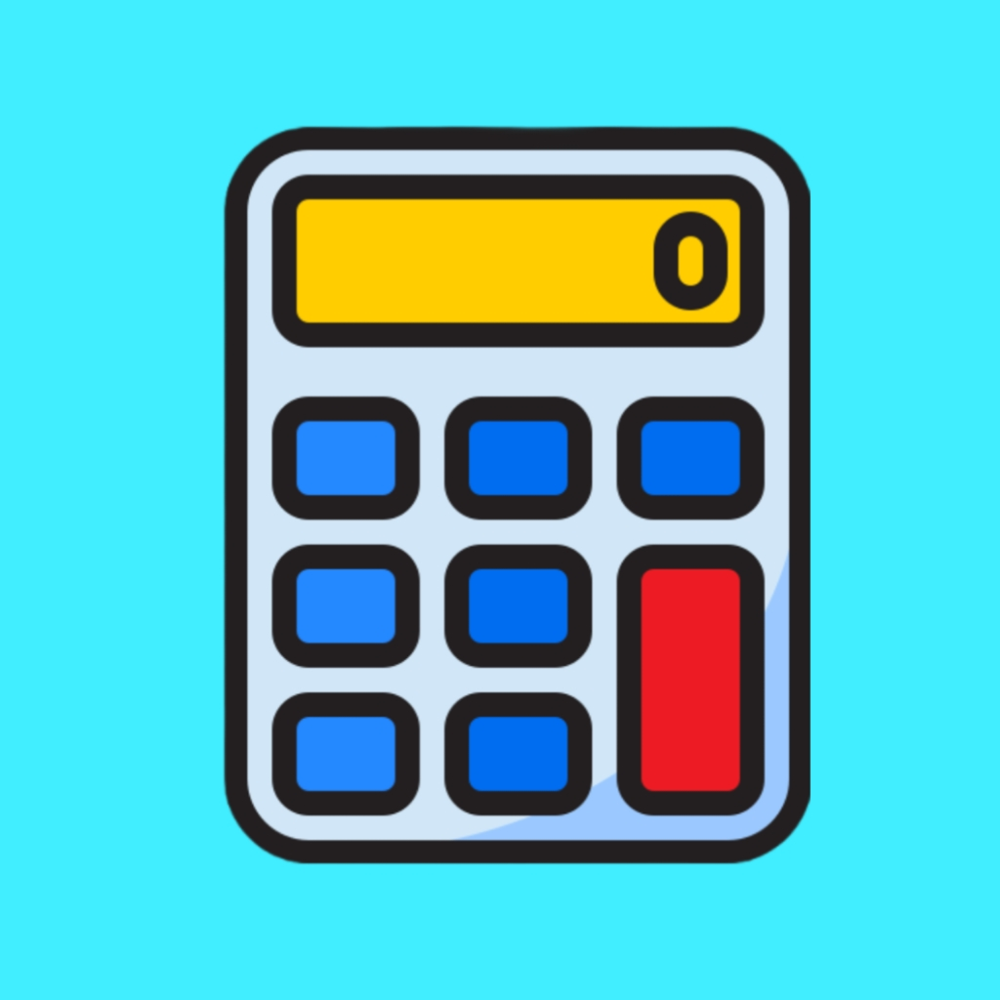

  
# AS Calculator
  

  
## 📖 Features
* Lightweight (under 15 Mb APK size)
* No unnecessary permissions
* Dark, Light, Amoled and Material You theme
* Scientific mode
* History
* Very fast and snappy !
  

  

